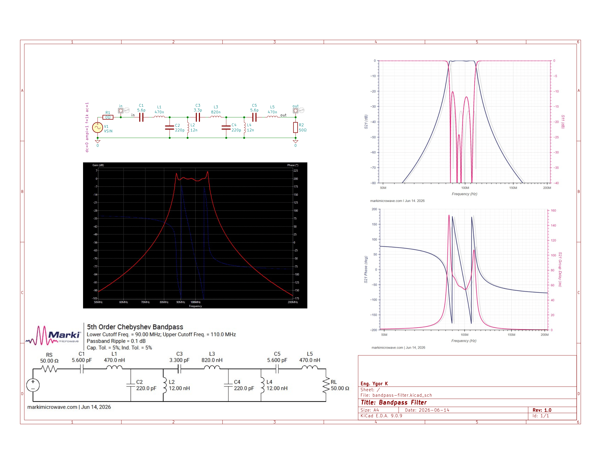
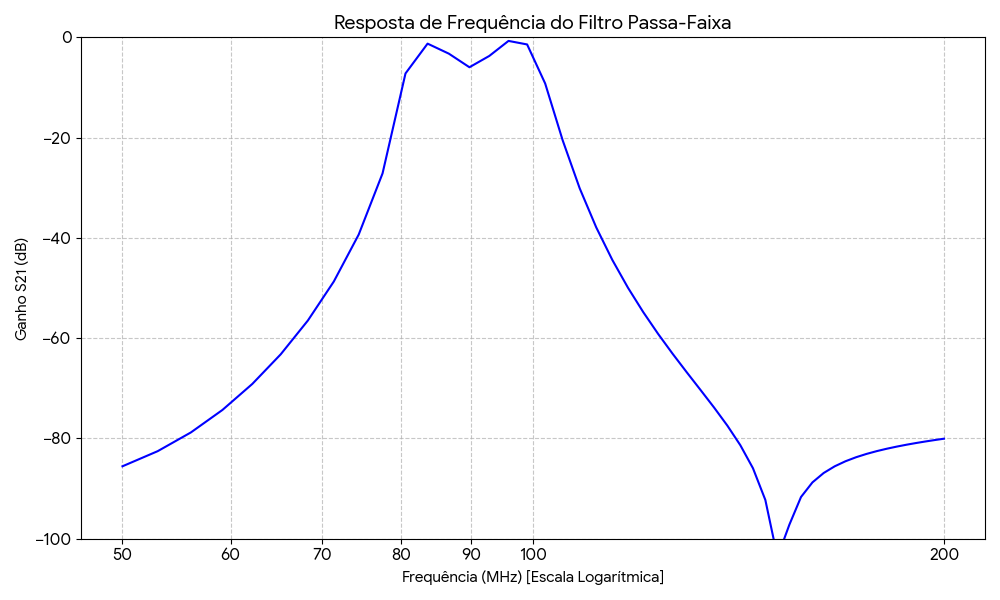

# Bandpass-Filter-Sim

Bandpass filter project and simulation using KiCAD (v9.0.9), FreeCAD (v1.1.1) and EMerge Software (v2.7.3) to get S parameters from a PCb design.

## 5th Bandpass Filter

The filter was designed from Marki Microwave, in this [link](https://markimicrowave.com/technical-resources/tools/lc-filter-design-tool/). It is a 5th order Chebyshev bandpass with lower cutoff frequency of 90MHz, and upper cutoff frequency of 110MHz. Passband ripple of 0.1dB, capacitors and inductors tolerance of 5% and commercial values.

The design can be viewed in SCH from KiCAD, with the results from Marki Microwave and KiCAD simulation.

## Simulation in EMerge

With the KiCAD design done, the next step was to model in FreeCAD and simulate in EMerge with the help of the macro FreeCAD-OpenEMS-Export. After modeling, meshing it and simulating, the results are shown below.

Some points are not the same because of RAM limitations in my machine, I was using only 50 points to calculate it. But it shown a good result for a simple model.

## Future works

This simulation demonstrate an example of modeling lumped components in FreeCAD for EMerge software this. Merging this feature with PCB Antenna desing, full RF systems can be simulate using open source software, as matching networks and some crazy antenna designs! Thanks for spending time here with me.
